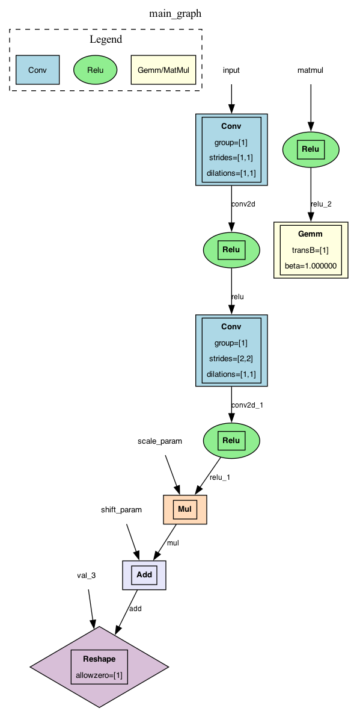

# ONNX Parser

A parser for neural network computational graphs from the **ONNX** format in **C++**.

The project implements a graph data structure, conversion of an ONNX model into an internal graph, support for the main neural network operations, and visualization using GraphViz.

---

## Features

| Feature | Description |
|---------|-------------|
| **ONNX Parsing** | Reading the binary format (protobuf/varint) |
| **Graph in C++** | Classes `Graph`, `Node`, `Tensor` |
| **8+ operations** | Conv, Relu, Gemm, MatMul, Add, Mul, Reshape, Concat |
| **Attributes** | strides, dilations, group, alpha, beta, transB, allowzero, auto_pad |
| **Visualization** | Export to GraphViz DOT with colors and shapes |
| **Tests** | 3 test models + CMake testing |

---

## Requirements

| Component | Version | Purpose |
|-----------|---------|---------|
| C++ compiler | C++17 (GCC 7+, Clang 5+, AppleClang 15+) | Building the project |
| CMake | 3.10+ | Build system |
| GraphViz | Any | Graph visualization |

## Build

```bash
# 1. Create the build folder
mkdir -p build && cd build

# 2. Run CMake
cmake ..

# 3. Build the project
make

# 4. Run the tests
ctest --verbose
```

## Run

```bash
# Basic run
./parser path/to/model.onnx

# Examples with test models
./parser ../tests/simple_matmul.onnx
./parser ../tests/complex_net.onnx
./parser ../tests/custom_net.onnx
```

### Example output

```bash
=== Loading: tests/complex_net.onnx ===

=== Parsed Graph Info ===
IR version: 10
Producer: pytorch v2.10.0
Graph name: main_graph

=== Nodes ===
Op: Conv
  Inputs: input conv1.weight conv1.bias
  Outputs: conv2d
  [group: 1]
  [strides: 1 1]
  [dilations: 1 1]

Op: Relu
  Inputs: conv2d
  Outputs: relu

...

✅ Parsing completed successfully!
```

## Supported operations and their attributes

| Operation | Attributes | Description |
|-----------|------------|-------------|
| **Conv** | `strides`, `dilations`, `group`, `auto_pad` | Convolution |
| **Relu** | — | Activation function |
| **Gemm** | `alpha`, `beta`, `transA`, `transB` | Fully connected layer |
| **MatMul** | — | Matrix multiplication |
| **Add** | — | Element-wise addition |
| **Mul** | — | Element-wise multiplication |
| **Reshape** | `allowzero` | Changing the tensor shape |
| **Concat** | `axis` | Tensor concatenation |
| **Shape** | — | Getting the tensor shape |

## Project structure

```bash
.
├── CMakeLists.txt          # Build configuration
├── README.md               # Documentation
├── .gitignore              # Ignored files
├── include/
│   ├── bin_reader.h        # Reading bytes and varint
│   └── parser.h            # Classes Graph, Node, Tensor
├── src/
│   ├── main.cpp            # Entry point
│   └── parser.cpp          # Parser implementation
└── tests/
    ├── simple_matmul.onnx  # Test 1: Basic MatMul
    ├── complex_net.onnx    # Test 2: CNN + FC layers
    └── custom_net.onnx     # Test 3: Real model
```

## Tests

The project includes 3 test models:

| Model | Description | Operations |
|-------|-------------|------------|
| `simple_matmul.onnx` | Simple matrix multiplication | `MatMul` |
| `complex_net.onnx` | CNN + Fully Connected | `Conv`, `Relu`, `Reshape`, `Gemm` |
| `custom_net.onnx` | Real model | `Conv`, `Relu`, `Add`, `Mul`, `Gemm` |

### Running the tests

```bash
cd build
ctest --verbose
```

## Architecture

### Classes

| Class | Description |
|-------|-------------|
| **BinaryReader** | Low-level reading of bytes and varint |
| **Tensor** | Tensor storage (name, dimensions, type, data) |
| **Node** | Graph operation (type, inputs, outputs, attributes) |
| **Graph** | Computational graph (nodes, tensors, inputs, outputs) |
| **ONNXParser** | Main parser (reading ONNX → Graph) |

### ONNX format

ONNX uses protobuf serialization:

- Varint — variable-length integer encoding
- Wire types — field types (0=varint, 2=length-delimited, 5=fixed32)
- Field numbers — protocol field identifiers

## Graph visualization

Example of the parser working on the `custom_net.onnx` model:



## Author

**Galina Busarova**
